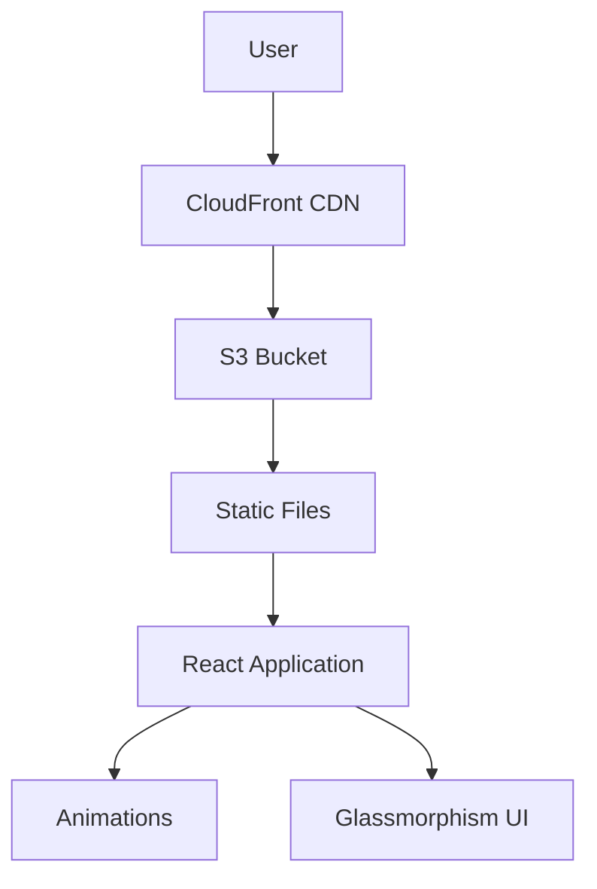

# Interactive Resume Deployment with Pulumi

This project contains infrastructure-as-code using Pulumi and a GitHub Pages deployment of a static resume site.

## Repositories

- [Frontend (Static Website)](https://github.com/mahesh-space/frontend)
- [Infrastructure (Pulumi Code)](https://github.com/mahesh-space/interactive-res)

## 🌟 Key Features
- **Glassmorphism UI Design** with backdrop filters
- **Scroll-triggered Animations** using Framer Motion
- **Responsive Layout** for all device sizes
- **AWS Cloud Deployment** with S3 + CloudFront
- **Cost-Optimized Infrastructure** (<$1/month)
- **CI/CD Ready** configuration

## 🛠️ Tech Stack
**Frontend**
- React 18 + TypeScript
- Styled Components
- Framer Motion 10

**Infrastructure**
- Pulumi 3.105 (TypeScript)
- AWS S3 + CloudFront
- AWS Certificate Manager

## 🚀 Quick Deployment

### Prerequisites
- Node.js 18+
- Pulumi CLI
- AWS CLI credentials

```bash
# Clone repository
git clone https://github.com/mahesh-space/interactive-res.git
cd interactive-res

# Install frontend dependencies
cd frontend && npm install

# Install infrastructure dependencies
cd ../infra && npm install
```

## 🔧 Infrastructure Architecture



## 🛠️ Pulumi Configuration

1. **Initialize Pulumi Stack**
```bash
cd infra
pulumi stack init dev
```

2. **Set AWS Configuration**
```bash
pulumi config set aws:region us-west-2
pulumi config set interactive-resume:sitePath ../frontend/build
```

3. **Deploy Infrastructure**
```bash
# Build React app
cd ../frontend && npm run build

# Deploy AWS resources
cd ../infra && pulumi up
```

## 🔗 Access Your Resume
After successful deployment, get your CloudFront URL:
```bash
pulumi stack output url
# Example output: https://d1234abcd.cloudfront.net
```

## 🏆 Best Practices Implemented
- **Security**
  - S3 bucket private access
  - Origin Access Identity
  - HTTPS enforcement
- **Performance**
  - Global CDN distribution
  - Gzip compression
  - Browser caching headers
- **Cost Control**
  - CloudFront Price Class 100
  - S3 Intelligent-Tiering
  - Budget alerts setup

## 🧑💻 Local Development
```bash
cd frontend
npm start # Starts development server @ localhost:3000

# Build production bundle
npm run build
```

## 📄 License
MIT License - See [LICENSE](LICENSE) for details

## 🤝 Contribution
1. Fork the repository
2. Create feature branch (`git checkout -b feature/amazing-feature`)
3. Commit changes (`git commit -m 'Add amazing feature'`)
4. Push to branch (`git push origin feature/amazing-feature`)
5. Open Pull Request

## 🙏 Acknowledgments
- Pulumi for amazing IaC tools
- AWS Free Tier
- Framer Motion team for animation library
